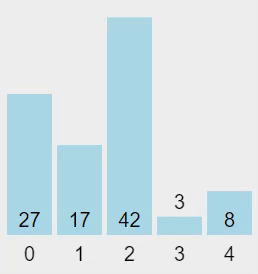
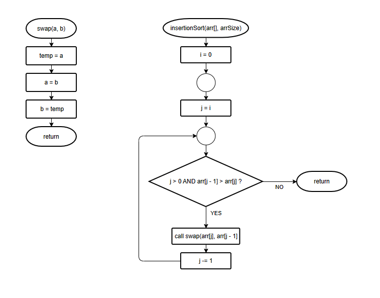

# Tugas Pendahuluan 3
Nama:  Muhammad Nadzhif Fikri
NPM: 2306210102

## 1. Sebutkan 4 jenis sorting dan jelaskan cara kerjanya! Berikan contoh kode sederhana dan visualisasi dari masing masing jenis sorting yang diberikan, beserta nilai kompleksitasnya (40 poin)

- Insertion Sort: Algoritma melakukan sorting setiap elemen satu per satu dari kiri. Algoritma secara tidak langsung membuat partisi terurut pada sebelah kiri array. Setiap algoritma memperbesar partisi tersebut ke sebelah kanan array, elemen terbaru yang masuk digeser ke kiri selama elemen di sebelah kiri posisinya masih lebih besar hingga berada pada posisi yang tepat, dimasukkan (_insertion_). Perulangan dilakukan terus hingga partisi terurut di sebelah kiri menjadi keseluruhan dari array yang ingin diurutkan. <br> Algoritma memasukan setiap elemen baru pada dengan kompleksitas O(N) lalu untuk setiap elemen yang baru masuk digeser ke kiri sebanyak elemen sebelumhya dengan kompleksitas O(N) sehingga keseluruhan kompleksitas algoritma berupa O(N^2^). 

    ```C
    void swap(int *a, int *b) // Fungsi penukar
    {
        int temp = *a;
        *a = *b;
        *b = temp;
    }

    void insertionSort(int arr[], int n) 
    {
        int i, key, j;
        for (i = 1; i < n; i++) // Lakukan pada setiap elemen dari kiri ke kanan
        {
            key = arr[i]; // Key sebagai elemen yang akan dimasukkan (_insert_)
            j = i - 1; // Indeks titik masukkan, mulai dari paling kanan partisi

            while (j >= 0 && arr[j] > key) // Selama indeks masukkan masih belum 0 dan elemen pada indeks masih lebih besar dari key
            {
                arr[j + 1] = arr[j];  // Geser elemen-elemen pada partisi untuk memberi ruang ke key
                j = j - 1;
            }
            arr[j + 1] = key; // Memasukkan key ke posisi pada partisi
        }
    }
    ```
<br>

- Selection Sort: Selection sort juga secara tidak langsung membuat partisi terurut pada sisi kiri dari array, namun kali ini untuk memperbesar partisi tersebut algoritma melakukan pemilihan (_selection_) untuk mendapatkan elemen terkecil dari setiap elemen yang belum terurut untuk dimasukkan. Dengan begini array terurut satu per satu dari kiri. Algoritma memasukkan elemen satu per satu dengan kompleksitas O(N), pemilihan elemen terkecil untuk dimasukkan memiliki kompleksitas O(N), keseluruhan algoritma berkompleksitas O(N^2^).
    ```C
    void swap(int *a, int *b) // Fungsi penukar
    {
        int temp = *a;
        *a = *b;
        *b = temp;
    }

    void selectionSort(int arr[], int n) 
    { 
        int i, j, min_idx; 

        for (i = 0; i < n - 1; i++) // Mulai dari kiri
        { 

            min_idx = i; // Indeks elemen terkecil (pada saat ini)
            for (j = i + 1; j < n; j++)  // Scanning untuk mencari elemen terkecil
            { 
                if (arr[j] < arr[min_idx]) 
                    min_idx = j; // Jadikan patokan elemen terkecil jika lebih kecil
            } 
    
            if (min_idx != i) 
                swap(arr[min_idx], arr[i]); // Masukkan elemen terkecil 
        } 
    } 
    ```
<br>


- Merge Sort: Merge sort merupakan algoritma _divide and conquer_, yaitu algoritam yang memecah masalah utama menjadi masalah yang lebih kecil terlebih dahulu sehingga memudahkan penyelesaian. Dalam algoritma merge sort, array utama dipecah menjadi dua buah array yang kemudian dipecah lagi hingga akhirnya array pecahan hanya berjumlah 1 elemen. Setelah dipecah, setiap setiap pasang belahan array disatukan kembali (_merge_) dengan memerhatikan urutannya ke sebuah array hasil yang lebih besar, array hasil yang lebih besar tersebut juga disatukan kembali dengan pasangannya secara terurut hingga akhirnya array kembali "utuh" lagi ke ukuran semula dengan konten yang terurut. <br>Algoritma melakukan _dividing_ problemnya menjadi dua hingga terpecah dengan kompleksitas O(logN) lalu pada setiap pecahan disatukan kembali satu per satu dengan kompleksitas O(N) sehingga algoritma keseluruhan memiliki kompleksitas O(NlogN)
    ```c
    void merge(int array[], int const left, int const mid, int const right)
    {
        int const subArrayOne = mid - left + 1; // Ukuran partisi kiri
        int const subArrayTwo = right - mid; // Ukuran partisi kanan
    
        // Alokasikan dua buah array temporer untuk kedua partisi
        int *leftArray = malloc(sizeof(int) * subArrayOne),
            *rightArray = malloc(sizeof(int) * subArrayTwo);
    
        for (int i = 0; i < subArrayOne; i++) // Copy konten partisi ke array temporer
            leftArray[i] = array[left + i];
        for (int j = 0; j < subArrayTwo; j++)
            rightArray[j] = array[mid + 1 + j];
    
        int indexOfSubArrayOne = 0, indexOfSubArrayTwo = 0; // Mulai indeks setiap array temporer
        int indexOfMergedArray = left;
    
        // Memasukan ke array utama berdasarkan urutan pada kedua array merger
        while (indexOfSubArrayOne < subArrayOne && indexOfSubArrayTwo < subArrayTwo) {
            if (leftArray[indexOfSubArrayOne] <= rightArray[indexOfSubArrayTwo]) // Jika konten pada array kiri lebih kecil
            {
                array[indexOfMergedArray] = leftArray[indexOfSubArrayOne]; // Masukkan konten array kri
                indexOfSubArrayOne++; // Naikkan indeks konten array kiri
            }
            else // Jika kanan lebih kecil
            {
                array[indexOfMergedArray] = rightArray[indexOfSubArrayTwo]; // Masukkan konten array kanan ke array utama
                indexOfSubArrayTwo++; // Naikan indeks konten array kanan
            }
            indexOfMergedArray++; // Tingkatkan indeks array utama, sesuai jumlah elemen yang sudah masuk
        }
    
        // Jika partisi kiri masih tersisa, masukkan semua ke array utama
        while (indexOfSubArrayOne < subArrayOne) {
            array[indexOfMergedArray] = leftArray[indexOfSubArrayOne];
            indexOfSubArrayOne++;
            indexOfMergedArray++;
        }
    
        // Jika elemen array kanan masih terisa, masukkan semua ke array utama
        while (indexOfSubArrayTwo < subArrayTwo) {
            array[indexOfMergedArray] = rightArray[indexOfSubArrayTwo];
            indexOfSubArrayTwo++;
            indexOfMergedArray++;
        }
        free(leftArray); // Bebaskan kedua array temporer
        free(rightArray;)
    }
    
    void mergeSort(int array[], int const begin, int const end)
    {
        if (begin >= end) // Jika partisi sudah terkecil (berelemen 1), berhenti
            return;
    
        int mid = begin + (end - begin) / 2; // Indeks elemen tengah
        mergeSort(array, begin, mid); // Lakukan mergesort pada partisi sisi kiri
        mergeSort(array, mid + 1, end); // Mergesort pada partisi sisi kanan
        merge(array, begin, mid, end); // Gabungkan kedua belah partisi
    }
    ```
<br>


- Quick Sort: Quick sort juga merupakan algoritma _divide and conquer_ namun kali ini pada setiap array terdapat sebuah elemen sebagai pivot, setiap elemen pada array yang lebih besar dari pivot diletakkan di sebelah kanan pivot dan yang lebih kecil di sebelah kiri, setelah itu algoritma dilakukan lagi ke setiap partisi elemen pada kiri dan kanan pivot, operasi diulang hingga ke elemen terkecil dari partisi sehingga keseluruhan array menjadi terurut. Partisi dilakukan hingga array terpecah total sehingga memiliki kompleksitas O(logN) dan operasi pivoting kanan kiri elemen memiliki kompleksitas O(N) sehingga keseluruhan algoritma memiliki kompleksitas O(NlogN)

    ```c
    void swap(int *a, int *b) // Fungsi penukar
    {
        int temp = *a;
        *a = *b;
        *b = temp;
    }
                
    void quickSort(int arr[],int low,int high)
    {
    if(low<high)  // Lakukan selama elemen pada partisi lebih dari 1 (batas kiri dan kanan tidak sama)
    {
        
        int pivot = arr[high]; // Pivot, diambil secara acak, pada kasus ini elemen paling kanan partisi
        int i = low - 1; // Indeks belahan partisi, mulai dari paling kiri

        for (int j = low; j <= high; j++)
        {
            if (arr[j] < pivot) // Elemen lebih kecil dari pivot sebelah kiri
            {
                i++; // Geser belahan partisi ke kanan 
                swap(&arr[i], &arr[j]); // Tukar elemen
            }
        }
        swap(arr[i+1], arr[high]); // Letakan elemen pivot ke posisi partisi

        quickSort(arr, low, i); // Lakukan kembali pada partisi kiri
        quickSort(arr, i + 2, high); // Lakukan pada partisi kanan
    }
    }
    ```

**Referensi:**
- "Sorting Algorithms" GeeksforGeeks.  [Online]. Available: https://www.geeksforgeeks.org/sorting-algorithms/. [Accessed: 26-Feb-2024]
- "Selection Sort - Data Structure and Algorithm Tutorials" GeeksforGeeks.  [Online]. Available: https://www.geeksforgeeks.org/selection-sort/. [Accessed: 26-Feb-2024]
- "Merge Sort - Data Structure and Algorithm Tutorials" GeeksforGeeks.  [Online]. Available: https://www.geeksforgeeks.org/merge-sort/. [Accessed: 26-Feb-2024]
- "Insertion Sort - Data Structure and Algorithm Tutorials" GeeksforGeeks.  [Online]. Available: https://www.geeksforgeeks.org/insertion-sort/. [Accessed: 26-Feb-2024]
- "QuickSort - Data Structure and Algorithm Tutorials" GeeksforGeeks.  [Online]. Available: https://www.geeksforgeeks.org/quick-sort/. [Accessed: 26-Feb-2024]

## 2. Analisislah skenario dari visualisasi sorting berikut! Jenis sorting apakah yang dilakukan pada GIF di atas? Jelaskan dan buatlah diagram alur dari program atau flowchart dari skenario diatas (25 poin)

Sorting yang dilakukan merupakan insertion sort. Algoritma melakukan sorting satu per satu dari kiri. Pada setiap lengkah secara tidak langsung terbentuk suatu partisi di sebelah kiri array yang sudah terurut, ketika langkah selanjutnya dilaksanakan di mana elemen baru dari sebelah kanan partisi "dimasukkan" ke dalam partisi yang terurut, partisi tersebut bergeser ke kanan hingga ditemukan posisi yang tepat untuk elemen baru yang dimasukkan sehingga partisi terurut tersebut membesar hingga akhirnya partisi terurut mencangkup keseluruhan dari array yang ingin diurutkan.


## 3. Ubahlah  flowchart tersebut menjadi program dalam bahasa C (20 poin)

```c

void swap(int *a, int *b)
{
    int temp = *a;
    *a = *b;
    *b = temp;
}

void insertionSort(int arr[], int arr_size)
{
    for (int i = 0; i < arr_size; ++i)
    {
        int j = i;
        while (j > 0 && arr[j - 1] > arr[j])
        {
            swap(&arr[j], &arr[j - 1]);
            j--;
        }
    }
}

```

## 4. Perhatikan potongan kode berikut! Apakah output program tersebut? Berapa kali program melakukan swap element? Jelaskan! (15 poin)
```c
#include <stdio.h>

void swap(int *a, int *b) {
    int temp = *a;
    *a = *b;
    *b = temp;
}

void insertionSort(int arr[], int n) {
    int i, key, j;
    for (i = 1; i < n; i++) {
        key = arr[i];
        j = i - 1;

        while (j >= 0 && arr[j] > key) {
            arr[j + 1] = arr[j];
            j = j - 1;
        }
        arr[j + 1] = key;
    }
}

void printArray(int arr[], int n) {
    int i;
    for (i = 0; i < n; i++)
        printf("%d ", arr[i]);
    printf("\n");
}

int main() {
    int arr[] = {12, 11, 13, 5, 6, 8, 9};
    int n = sizeof(arr) / sizeof(arr[0]);

    insertionSort(arr, n);
    printArray(arr, n);

    return 0;
}
```

Output dari program berupa sebuah array yang terurut. Di dalam program terkandung tiga buah fungsi, swap yang berfungsi menukar value dari dua buah lokasi memori integer (fungsi tidak terpakai di program utama), printArray yang melakukan printing n buah integer pertama dari sebuah array ke stdout, serta insertionSort yang melakukan algoritma perurutan (sorting).

Insertion sort merupakan algoritma pengurutan yang mengurutkan sebuah array dengan mengurutkan array tersebut sedikit demi sedikit dari kiri. 

Pada berjalannya program dengan array ```12, 11, 13, 5, 6, 8, 9``` terdapat 14 kali pertukaran. (Pada kasus ini tidak jelas apa yang sebenarnya dihitung "pertukaran", belum lagi fungsi swap-nya nggak terpakai, tapi ini yang mungkin bisa dihitung "pertukaran").
```
    12, 11, 13, 5, 6, 8, 9
    |    |

    11, 12, 13, 5, 6, 8, 9
             |  |

    11, 12, 5, 13, 6, 8, 9
        |   |

    11, 12, 5, 13, 6, 8, 9
        |   |

    11, 5, 12, 13, 6, 8, 9
    |   |

    5, 11, 12, 13, 6, 8, 9
               |   |

    5, 11, 12, 6, 13, 8, 9
           |   |

    5, 11, 6, 12, 13, 8, 9
       |   |


    5, 6, 11, 12, 13, 8, 9
                  |   |

    5, 6, 11, 12, 8, 13, 9
              |   |

    5, 6, 11, 8, 12, 13, 9
          |   |

    5, 6, 8, 11, 12, 13, 9
                     |   |

    5, 6, 8, 11, 12, 9, 13
                 |   |

    5, 6, 8, 11, 9, 12, 13
             |   |
    
    5, 6, 8, 9, 11, 12, 13

    TERURUT !! :3333 ⸜(｡˃ ᵕ ˂ )⸝♡ hore
```
