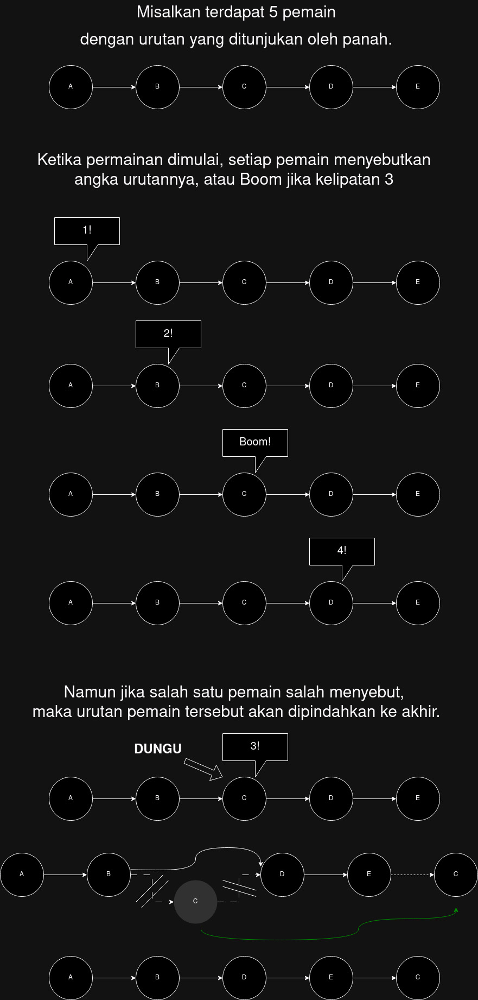

# Case Study 6 - Linked List

Pada praktikum kali ini, kita akan membuat sebuah local multiplier game:

## Cara Bermain
1. Setiap pemain akan menyebutkan angka secara berurutan.
2. Setiap kali anda menemukan angka kelipatan 3, anda harus menyebut kata '**Boom**'.
3. Jika ada pemain yang salah menyebut, pemain tersebut akan dipindahkan ke urutan terakhir, program akan menuliskan '**Selesai**'
4. Apabila semua pemain berhasil menyebut dengan benar, maka program akan menuliskan '**Selesai**'
5. Apabila permainan selesai, kembali ke menu.

## Alur Program
1. Setiap pemain mendaftarkan nama. Yang disimpan pada program adalah nama pemain dan skor (default = 0)
2. Permainan dimulai dengan urutan yang sama dengan urutan pemain mendaftar.

## Perhitungan Poin
1. Pemain akan mendapat **penambahan** 1 poin apabila menyebut angka atau 'Boom' dengan **benar**.
2. Pemain akan mendapat **pengurangan** 1 poin apabila menyebut angka atau 'Boom' dengan **salah**.
3. Pemain **tidak** mendapat poin apabila tidak menyebut angka atau 'Boom'. *Dapat terjadi ketika pemain giliran sebelumnya melakukan kesalahan sehingga permainan berakhir sebelum giliran pemain tersebut*.

## Batasan
1. Tidak ada batasan jumlah pemain. Namun permainan hanya dapat dimainkan ketika minimal terdapat 5 pemain.
2. Atribut objek `Pemain` terdiri dari `Nama` dan `Skor`
3. Program meminta menu : 
- 1. Input Pemain
- 2. Lihat Urutan
- 3. Mulai Permainan
4. Minimal terdapat 1 (satu) buah fungsi selain fungsi utama atau `main()`
5. Atribut `Nama` maksimal 10 karakter

----------

“To ask the right question is harder than to answer it.”
  - Georg Cantor

---------

# Pembahasan:

## Bagian 1: THE Game

Dalam CS kali ini, kita membuat sebuah game. Secara gameplay, gamenya sendiri sederhana:

1. Terdapat sebuah urutan pemain dengan skor awal 0.
2. Setiap pemain menulis angka urutannya, atau "Boom" jika angka urutannya kelipatan 3.
3. Jika seorang pemain salah menyebut, permainan selesai dan pemain tersebut dipindahkan ke urutan terakhir pada permainan selanjutnya.
4. Setiap pemain yang menyebutkan benar, skornya +1, jika salah skornya -1, dan jika tidak dapat kesempatan sama sekali (karena ada pemain salah sebelum dia), maka skor tidak berubah.
5. Permainan hanya dapat dimulai dengan minimum jumlah pemain 5.

`Jir bro gini mah gua juga ngerti, implementasinya gimana???`

## Bagian 2: Implementasi

