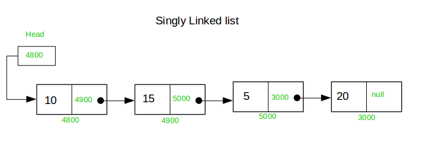
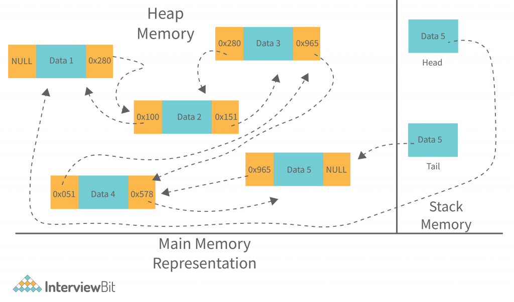
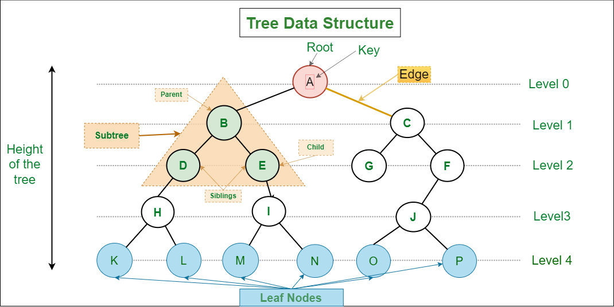
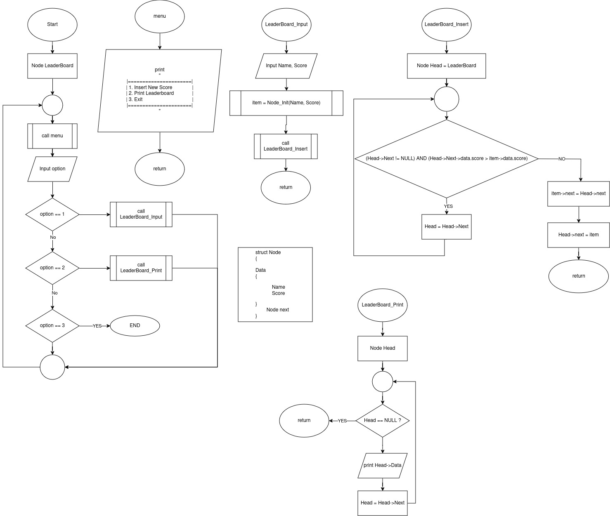

# Tugas Pendahuluan 
Nama: Muhammad Nadzhif Fikri
NPM: 2306210102

## 1. Jelaskan semua yang anda pahami tentang Linked List (Tidak perlu terlalu panjang, tapi pastikan bahwa jika ada anak SMP yang membaca tulisan anda dapat mengerti apa itu Linked List). Anda dapat menyertakan gambar (dapat gambar sendiri atau dari referensi) yang memudahkan pembaca memahami apa yang anda ingin sampaikan. Silahkan cantumkan contoh apabila diperlukan. (30 poin)
Linked list adalah struktur data yang memanfaatkan heap dengan struktur relasional seperti rantai.

Heap, memori dinamis yang dipanggil menggunakan `malloc()` dan kawan-kawannya, pada dasarnya berupa penggunaan memori yang tidak selalu terurut dibandingkan dengan stack yang datanya terurut bersebelahan. 

Linked list memanfaatkan memori dinamis pada heap sehingga data dengan mudah ditambahkan atau dihilangkan namun karena ini, setiap data linked list juga butuh menyimpan sebuah pointer ke data selanjutnya. Dengan menghubungkan node-node (kontainer data pada linked list yang mengandung data itu sendiri dan pointer node selanjutnya) sehingga setiap data pada linked list memiliki hubungan.

|  | 
|:--:| 
| *Linked List* |

|  | 
|:--:| 
| *Linked List dalam Heap* |

Linked list memiliki head dan tail, head (kepala) berupa node pertama dalam rantai dan tail, node terakhir yang tidak memiliki anak (pointer ke data selanjutnya) pada akhir rantai.

Dengan properti ini, data baru dapat ditambahkan dengan mengalokasikan memori baru yang lalu dihubungkan ke akhir tail. Tidak hanya itu, data baru juga bisa diletakkan di posisi manapun pada rantai linked list dengan memainpulasi urutan hubungan setiap node. Penghapusan data dapat dilakukan pada posisi manapun dengan "memutuskan" sebuah koneksi pada rantai linked list lalu dihubungkan lagi tanpa node data yang dihapus, data tersebut lalu dibebaskan dari memori agar tidak terjadi kebocoran memori.

Sebuah linked list dapat dijelajahi dengan menggunakan pointer yang menunjuk ke setiap node yang terdapat di dalam linked list satu per satu.


Linked list dapat digunakan untuk membuat berbagai macam struktur data. Array dinamis sederhana yang ukurannya dapat membesar dapat dibuat dengan linked list karena sistemnya yang menggunakan memori dinamis pada runtime. Struktur data lainnya di antaranya stack, struktur data LIFO (Last In First Out) di mana data yang terakhir masuk berupa terakhir yang dikeluarkan, dapat dibuat dengan memasukkan dan mengeluarkan data dari tail sebuah linkedlist serta queue, struktur data FIFO (First In First Out) di mana data paling awal dimasukkan merupakan data yang dikeluarkan pertama yang dapat dibuat dengan memasukkan data ke tail namun dikeluarkan di head.

Dengan mengubah jumlah relasi yang dapat dimiliki setiap node, dapat dibentuk struktur data graph atau dalam kondisi tertentu, tree yang dapat digunakan untuk menciptakan beragam jenis struktur data lebih lanjut seperti binary search tree untuk struktur data yang terurut, hingga priority queue yang dapat digunakan untuk mencari data terbesar.
|  | 
|:--:| 
| *Struktur data Tree* |

**Referensi:**
- Understanding the basics of Linked List. GeeksforGeeks. [Online]. Available: https://www.geeksforgeeks.org/what-is-linked-list/?ref=lbp. [Accessed: 15 Apr 2024]

- Singly Linked List definition & meaning DSA. GeeksforGeeks. [Online]. Available: https://www.geeksforgeeks.org/singly-linked-list-definition-meaning-dsa/. [Accessed: 15 Apr 2024]

- Types of Linked List in Data Structures. InterviewBit. [Online]. Available: https://www.interviewbit.com/blog/types-of-linked-list/. [Accessed: 15 Apr 2024]

- Implement a stack using singly linked list. GeeksforGeeks. [Online]. Available: https://www.geeksforgeeks.org/implement-a-stack-using-singly-linked-list/. [Accessed: 15 Apr 2024]

- Queue – Linked List Implementation. GeeksforGeeks. [Online]. Available: https://www.geeksforgeeks.org/queue-linked-list-implementation/. [Accessed: 15 Apr 2024]

- Introduction to Tree – Data Structure and Algorithm Tutorials. GeeksforGeeks. [Online]. Available: https://www.geeksforgeeks.org/introduction-to-tree-data-structure-and-algorithm-tutorials/. [Accessed: 15 Apr 2024]

- Binary Search Tree. GeeksforGeeks. [Online]. Available: https://www.geeksforgeeks.org/binary-search-tree-data-structure/. [Accessed: 15 Apr 2024]


## 2. Apa perbedaan Linked List dengan Queue, Stack, dan Tree? (10 poin)
Linked list merupakan struktur data relasiional dasar yang memiliki properti seperti rantai yang terurut. Properti linked list dapat dikembangkan untuk membuat struktur data lebih kompleks seperti queue, struktur data yang pertama masuk pertama keluar dan stack, struktur data yang terakhir masuk pertama keluar. 

Tree merupakan struktur data yang juga memiliki sifat data relasional seperti linked list namun memiliki lebih dari satu pointer "cabang" yang menghubungkan setiap node ke lebih dari satu node "anak" lain. Struktur data tree juga dapat dikembangkan untuk beragam struktur data lebih rumit lainnya.


**Referensi:**
- Types of Linked List in Data Structures. InterviewBit. [Online]. Available: https://www.interviewbit.com/blog/types-of-linked-list/. [Accessed: 15 Apr 2024]

- Implement a stack using singly linked list. GeeksforGeeks. [Online]. Available: https://www.geeksforgeeks.org/implement-a-stack-using-singly-linked-list/. [Accessed: 15 Apr 2024]

- Queue – Linked List Implementation. GeeksforGeeks. [Online]. Available: https://www.geeksforgeeks.org/queue-linked-list-implementation/. [Accessed: 15 Apr 2024]

- Introduction to Tree – Data Structure and Algorithm Tutorials. GeeksforGeeks. [Online]. Available: https://www.geeksforgeeks.org/introduction-to-tree-data-structure-and-algorithm-tutorials/. [Accessed: 15 Apr 2024]


## 3. Jelaskan mengenai Dynamic Memory Allocation (Malloc, Calloc, Free)! Apakah Dynamic Memory Allocation diperlukan dalam Linked List? Jika ya, peran dari Dynamic Memory Allocation pada bab ini? (10 poin)
Memori heap merupakan jenis memori yang dapat dialokasikan secara dinamis dalam runtime program. Dengan begini program dapat memanfaatkan jumlah memori yang lebih dinamis, variatif, dan umumnya lebih besar. Linked list memanfaatkan dynamic memory untuk mengalokasikan memori untuk setiap node. Dengan menggunakan dynamic memory, linked list dapat berkembang secara dinamis selama program dijalankan untuk memuat jumlah data yang besar.


**Referensi:**
- What is a Memory Heap?. GeeksforGeeks. [Online]. Available: https://www.geeksforgeeks.org/what-is-a-memory-heap/. [Accessed: 16 Apr 2024]

## 4. Anda sedang bekerja sebagai Game Developer "Tetris". Anda mendapat tugas dalam membangun fitur leaderboard pada game tersebut. Data yang ditampilkan leaderboard adalah ***Ranking, Name, Score*** yang diperoleh (nama boleh duplikat). Input data hanya ***Name, Score***. Sebelum anda mulai melakukan coding, tugas anda adalah membuat diagram Linked List dan Flow Chart dari projek yang anda ingin buat. (20 poin)


## 5. Buatlah soal no. 4 dalam bahasa C! Format input dibebaskan, namun harus ***User Friendly***. Format output dalam bentuk tabel dengan kolom ***Ranking, Name, Score*** (30 poin)

```c
#include <stdio.h>
#include <stdlib.h>
#include <string.h>

typedef unsigned int uint32;

typedef struct Node Node;

struct Node
{
    struct Data
    {
        char *name;
        uint32 score;
    } data;

    Node *next;
}; 

Node *Node_Init(char *name, unsigned int score)
{
    Node *temp = malloc(sizeof(Node));
    temp->data.name = name;
    temp->data.score = score;
    temp->next = NULL;
    return temp;
};

void Node_Attach(Node *parent, Node *child)
{
    parent->next = child;
}

void Tail_Insert(Node *head, Node *item)
{
    while (head->next != NULL)
    {
        head = head->next;
    }

    Node_Attach(head, item);
}

void LeaderBoard_Insert(Node *head, Node *item)
{
    while ((head->next != NULL) && (head->next->data.score > item->data.score))
    {
        head = head->next;
    }

    item->next = head->next;
    head->next = item;
}

void LeaderBoard_Print(Node *head)
{
    printf("[ %4s | %30s | %10s ]\n", "Rank", "Name", "Score");
    printf("======================================================\n");
    int rank = 0;
    head = head->next;
    while (head != NULL)
    {
        rank++;
        printf("[ %4d | %30s | %10d ]\n", rank, head->data.name, head->data.score);
        head = head->next;
    }
}

void Node_Print(Node *head)
{
    static int rank = 0;
    printf("[ %4d | %30s | %10d ]\n", rank, head->data.name, head->data.score);
    rank++;
}

void LeaderBoard_Input(Node *head)
{
    char buffer[30];
    unsigned int score;

    printf("Name: ");
    scanf("%s", buffer);
    printf("Score: ");
    scanf("%u", &score);

    size_t name_length = strlen(buffer);
    char *name = malloc(name_length + 1);
    strcpy(name, buffer);

    LeaderBoard_Insert(head, Node_Init(name, score));
}

void menu()
{
    printf("|======================|\n");
    printf("| 1. Insert New Score  |\n");
    printf("| 2. Print Leaderboard |\n");
    printf("| 3. Exit              |\n");
    printf("|======================|\n");
    printf("> ");
}

int main()
{
    Node* leaderboard = Node_Init("", 0);

    int option;
    do
    {
        menu();
        scanf("%d", &option);

        switch(option)
        {
            case 1:
                LeaderBoard_Input(leaderboard);
                break;
            
            case 2:
                LeaderBoard_Print(leaderboard);
                break;
        }

    } while (option != 3);
    
}
```